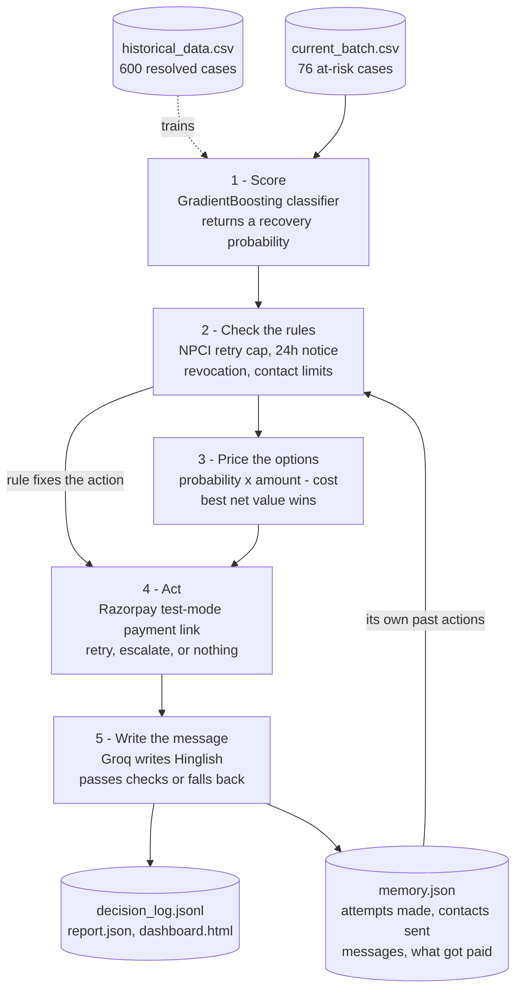
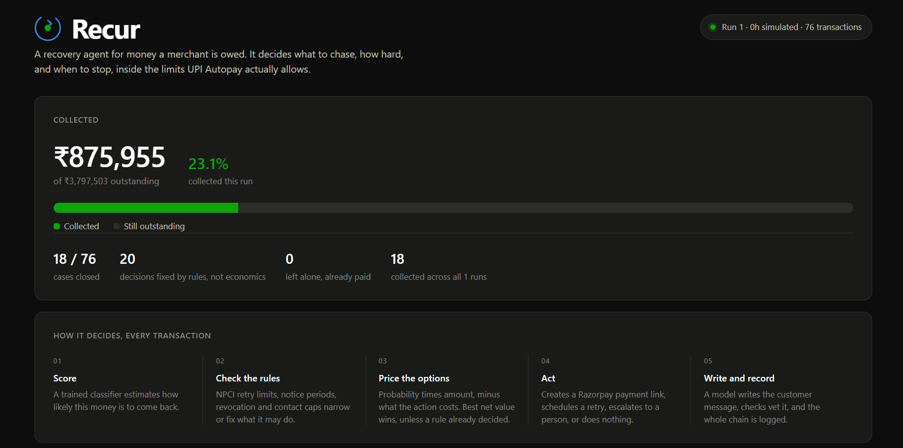
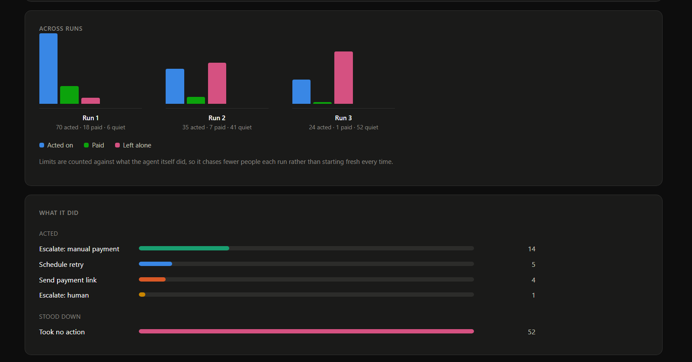
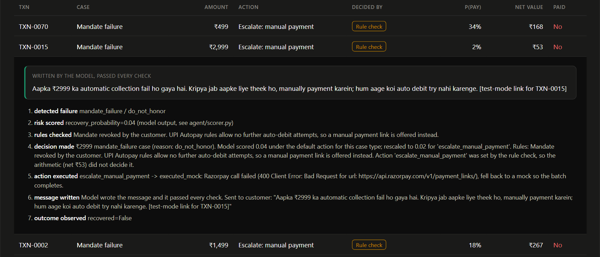

# Recur

An agent that chases payments a merchant is owed and hasn't received: failed
UPI Autopay mandates, abandoned checkouts, and overdue B2B invoices.

For each transaction it scores how likely the money is to come back, checks
what it's permitted to do under UPI Autopay rules, works out whether the
chase is worth its cost, runs the action (real Razorpay test-mode API calls
where one exists), writes the customer message with an LLM that is checked
before anything is sent, and records what it did. It remembers its own actions
between runs, so the retry and contact limits are enforced against attempts it
actually made rather than a number it was handed. `ARCHITECTURE.md` has the design
and the numbers from the current run.

Built for the Razorpay AI Buildathon 2026, Track 03.


## The flow 




## What it looks like



It remembers what it already did, so repeat runs chase fewer people. Paid
transactions drop out, retry and contact limits fill up, and it goes quiet.



Customer messages are written by an LLM and checked before anything is sent.
Amount, recipient, channel and whether to make contact are all decided before
the model is called.



## Running it

```bash
python -m venv .venv
source .venv/bin/activate        # Windows: .venv\Scripts\activate
pip install -r requirements.txt

cp .env.example .env             # optional. Add a Groq key for model-written
                                  # messages and Razorpay test-mode keys for real
                                  # payment links. Without them the pipeline runs
                                  # on templates and mocks.
python check_setup.py            # tells you which of those are actually live

python data/generate_data.py     # writes historical_data.csv + current_batch.csv
python agent/scorer.py           # trains the scorer, prints held-out AUC
python run_batch.py --reset      # first run, clean memory
python run_batch.py              # run again, agent remembers run 1
python make_dashboard.py         # renders reports/dashboard.html
```

Tests:

```bash
python tests/test_guardrails.py
python tests/test_decision_engine.py
python tests/test_messenger.py
python tests/test_memory.py
```

Run `run_batch.py` a few times in a row and watch it go quiet: paid
transactions stop being chased, retry and contact limits fill up, and by the
fourth run most of the batch gets no action at all.

## Output

| File | Contents |
|---|---|
| `reports/report.md` | Batch summary, readable |
| `reports/report.json` | Same, plus every per-transaction record |
| `reports/decision_log.jsonl` | One line per transaction: score, rules fired, decision, result |
| `reports/dashboard.html` | Browser view of the above, filterable |
| `reports/memory.json` | What the agent remembers between runs |
| `reports/training_metrics.json` | Model AUC, Brier score, feature importances |

## Layout

```
agent/scorer.py           scores recovery probability
agent/guardrails.py       UPI Autopay rule checks and contact limits
agent/decision_engine.py  expected value per action, picks one
agent/executor.py         runs the action, Razorpay API or simulated
agent/messenger.py        writes the customer message, checks it before use
agent/memory.py           state across runs, so limits count real actions
agent/logbook.py          per-transaction record
agent/pipeline.py         runs the stages across the batch
agent/ground_truth.py     simulation only, never seen by the scorer
data/generate_data.py     synthetic training set and current batch
run_batch.py              entry point
make_dashboard.py         renders the HTML view from report.json
```
